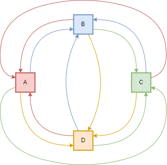

# knapsack

Il problema dello zaino, o in inglese Knapsack problem, è un problema di ottimizzazione combinatoria posto nel modo seguente.

Sia dato uno zaino che possa sopportare un determinato peso e siano dati N oggetti, ognuno dei quali caratterizzato da un peso e un valore. Il problema si propone di scegliere quali di questi oggetti mettere nello zaino per ottenere il maggiore valore senza eccedere il peso sostenibile dallo zaino stesso.

L'idea è di trasformare il problema del knapsack in una ricerca del percorso di peso minimo e di valore massimo all'interno di un grafo diretto pesato, dove ogni vertice è un oggetto ed ogni arco entrante è il relativo peso dell'oggetto (Per prendere l'oggetto rosso devo attraversare un arco rosso).

